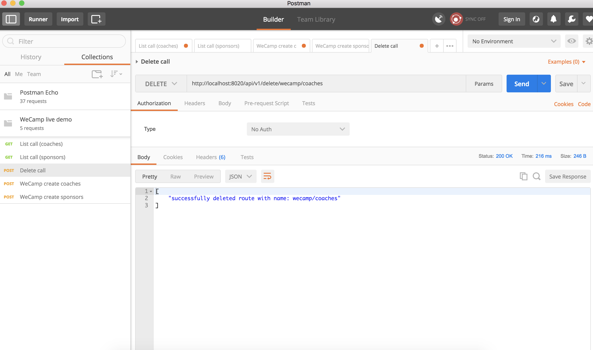

# API creator

## Installation

### Dependencies
Install the dependencies via composer from the project root:

```bash
composer install
```

### Run webserver

#### Using PHP's internal webserver
Go inside the `web` directory and start PHP's internal webserver.

NOTE: this webserver is _single-threaded_ and is not for production!

```bash
cd web
php -S 0.0.0.0:8000
````

#### Using Docker
Use the helper-script in the project-directory to spin up the Docker-container

```bash
# run docker-compose
docker-compose -f docker-compose.dev.yml up

# using the helper script in the root of the project
./dev up
```

##### Change PHP-version
If you want to change the PHP-version to work with, edit the file `docker-compose.dev.yml`.
Comment out the line for the PHP-version you don't want and un-comment the line for
the PHP-version you do want. Then start the Docker-containers with one of the commands above
like `./dev up`.

Then install the database (ignore the errors)
```bash
./dev exec db mysql -u root -proot api < resources/schema.sql
./dev exec db mysql -u root -proot api < resources/fixtures.sql
```

If you want to see the version of PHP you're currently using in the PHP-docker container,
you can issue the following command:
```bash
./dev exec php php -v

PHP 7.1.8-2+ubuntu16.04.1+deb.sury.org+4 (cli) (built: Aug  4 2017 13:04:12) ( NTS )
Copyright (c) 1997-2017 The PHP Group
Zend Engine v3.1.0, Copyright (c) 1998-2017 Zend Technologies
    with Zend OPcache v7.1.8-2+ubuntu16.04.1+deb.sury.org+4, Copyright (c) 1999-2017, by Zend Technologies
    with Xdebug v2.5.5, Copyright (c) 2002-2017, by Derick Rethans
```
### Run tests
There are functional tests to assure the correct working of the API.
These tests are created with behat.

Execute the tests with either the helper-script or with behat itself.
```bash
# use behat
cd tests/behat
../../vendor/bin/behat

# OR use the helper script in the root of the project
./dev test
```

## Usage

### Create call

In order to create a new call, specify the following data:
- website name or alias (will be used in the final URL of your API-request like `/api/v1/<name>/`)
- website URL (will be used to scrape the information from)
- (one or more) endpoint name(s) (will be used in the url of you API-request like `/api/v1/<websitename>/<endpoint>`)
- (one or more) type(s) The selector type should one of the following: XPATH, CSS or REGEX. Will default to CSS if not supplied.
- (one or more) selector. The selector that will point to the HTML-element on the website which contains the data you want to be exposed via the API.
-- In case of xpath, the format is as followed: /html/body/div/
-- in case of css, simply use the CSS selector. For example: div.class h5
-- in case of regex: NOT SUPPORTED YET
- (one or more) alias. This is the key which will be used to return the content of the above mentioned element. You can see this as providing the property-name. Like 'name' or 'date'.

On successful creation, an ID should be returned to you, which can be used to update or delete the call.

 
### Test call

Before submitting a new call, it might be wise to test your call first, to see if the response is retrieved that you might want.
To do so, simply call the /test endpoint, with the same parameters as you would the /create endpoint. 

 
### List call

To call the data you created in the create call, simply use the website name and endpoint name in your url as such:
<website_name>/<end_point_name>

 

### Search call
You can search inside one of the specified keys for a certain value. It will also search for partial matches.
To do this specify your route as such: <website_name>/<end_point>/search/<key>/<query>


### Delete call

To delete a call, simply call the following url: delete/<website_name>/<endpoint_name>
If no further endpoints exist on the website, the website will be deleted from the system as well.


